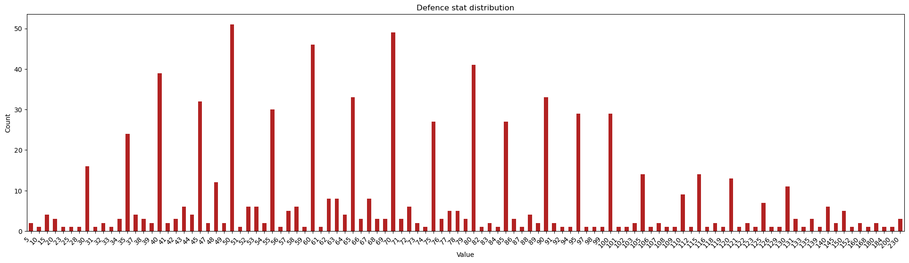

# Pokemon Data Analysis Project

As part of Cambridge Spark's Level 4 Data Analysis Skills Bootcamp, we were required to create a portfolio piece showcasing our learning from the programme.

This repository serves as my portfolio piece looking closely at a large set of data. Obviously, I chose Pokemon data.


Read more about this repository on LinkedIn:
1. [Part one](https://www.linkedin.com/pulse/data-cleaning-pandas-gregor-thomson-gorae/?trackingId=4zmwSvCETZa3Al6DYn7btA%3D%3D)
1. [Part two](https://www.linkedin.com/pulse/data-visualisation-matplotlib-gregor-thomson-jwe0e/?trackingId=rZFx0bskTQqMw5s1Juk5DQ%3D%3D)

## Data set

- The dataset is from kaggle
- It's pretty highly rated
- It's exhaustive in terms of Pokemon data

## Data processing

Generally, the dataset was pretty clean and ready to work with.

I had to go through a few stages of processing and cleaning. Largely, this was removing columns that I didn't want to work with.

There was one column with a mistake in the name spelling, which I corrected.

Three columns had `NaN` values for which there were reasonable conversion to make.

Finally, there were a set of Pokemon with missing height and weight values. I looked up these missing values manually, plugged them into two separate lists and then merged those into the original dataset.

## Analysing defence

I wanted to examine Pokemon statistics to look for interest. Perhaps correlation between type and stats. Or distributions of stats across generations.

I focused first on examining the defence stat.

Determining the mean, median and modal values for this stat. They are:

```js
{
    mean: 73,
    median: 70,
    mode: 50
}
```

Then I mapped a bar chart of all defence stats.



There seemed to be a trend emerging from this graph. However, values occuring only a few times skews the data's representation. By examining the stat in intervals, we can see more distinctly that there is a clear trend around the lower end of the scale which gradually levels out as the stat peaks.


Some interesting points here:
- Left to right can help us examine the values across generations
- The highest 3 values appear to be two steel types and a bug type
- Next we start to see appearances of a few rock, ground, and water types with steel and bug appearing again

We have a few outliers to the set of types we've seen already as we get further down. Examining these will be interesting. Looking at the graph, I can see that these outliers sit in two possible sets:
- Pokemon with a defence value higher than 125
- Top 25 Pokemon by defence

So let's examine these.

### Pokemon with a defence value higher than 125


| 1         | 2          | 3          | 4          | 5          |
|-----------|------------|------------|------------|------------|
| Golem     | Slowbro    | Cloyster   | Onix       | Forretress |
| Steelix   | Scizor     | Shuckle    | Skarmory   | Tyranitar  |
| Lugia     | Nosepass   | Lairon     | Aggron     | Torkoal    |
| Dusclops  | Relicanth  | Salamence  | Metagross  | Regirock   |
| Registeel | Groudon    | Bastiodon  | Rhyperior  | Leafeon    |
| Probopass | Dusknoir   | Uxie       | Gigalith   | Audino     |
| Cofagrigus| Carracosta | Ferrothorn | Cobalion   | Doublade   |
| Carbink   | Avalugg    | Wishiwashi | Toxapex    | Golisopod  |
| Pyukumuku | Turtonator | Cosmoem    | Buzzwole   | Kartana    |

List of types, no leg:
'rock' 'water' 'bug' 'steel' 'fire' 'ghost' 'dragon' 'ground' 'grass'
 'normal' 'ice' 'poison'

